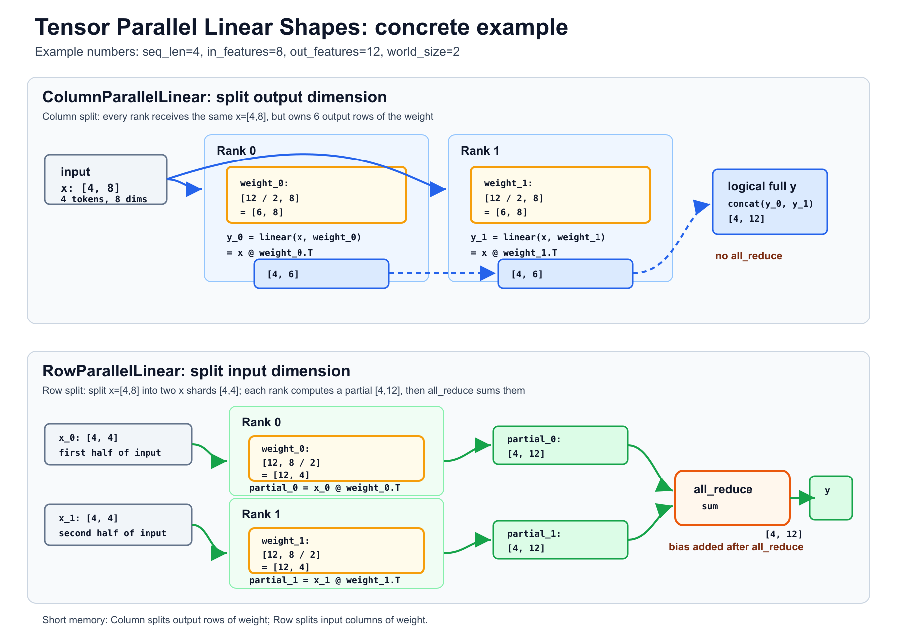
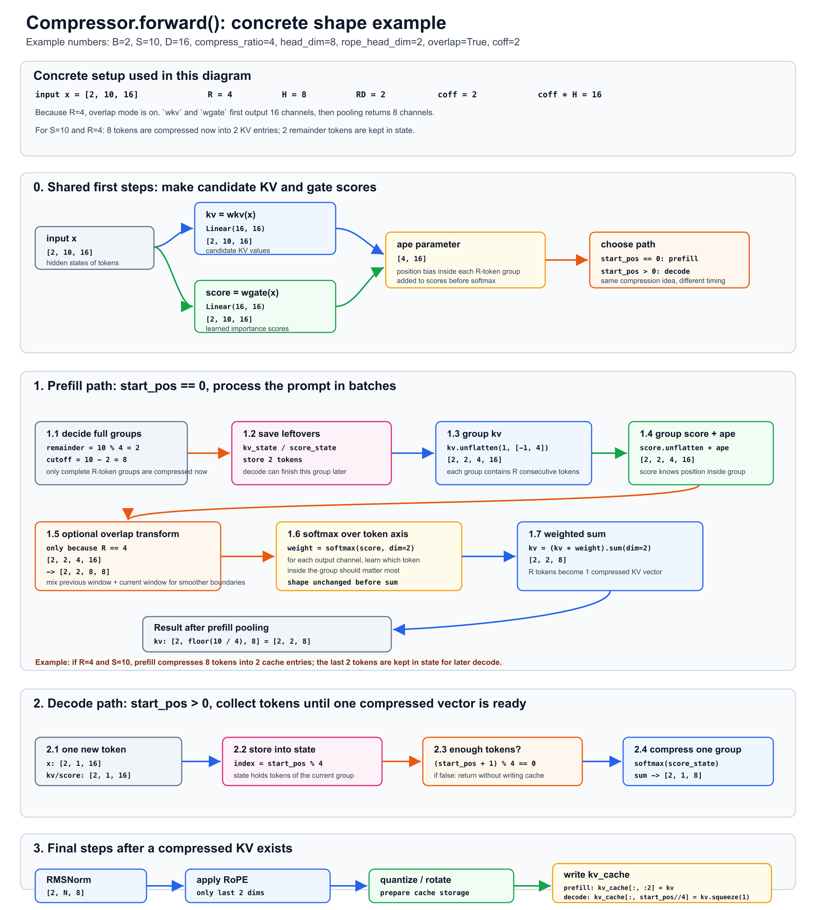
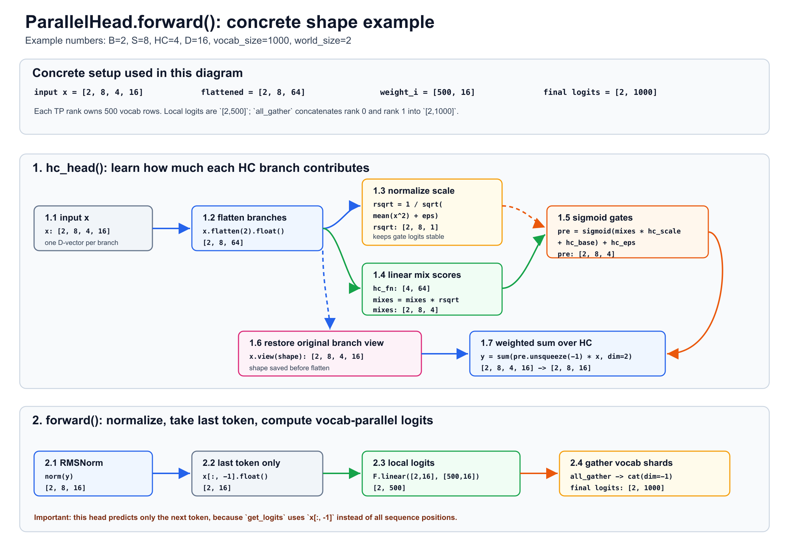
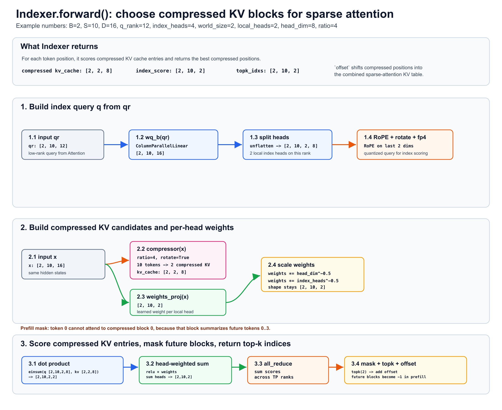
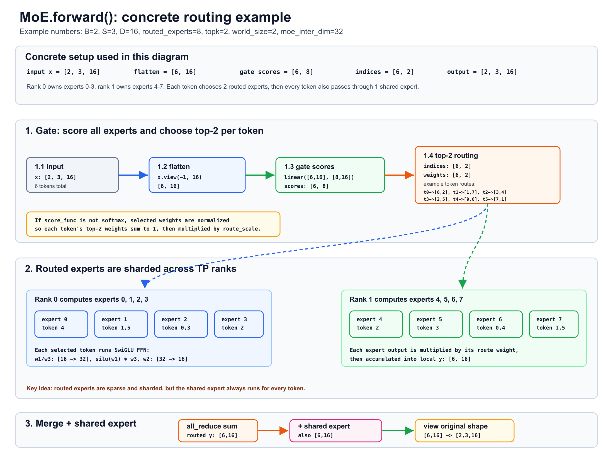
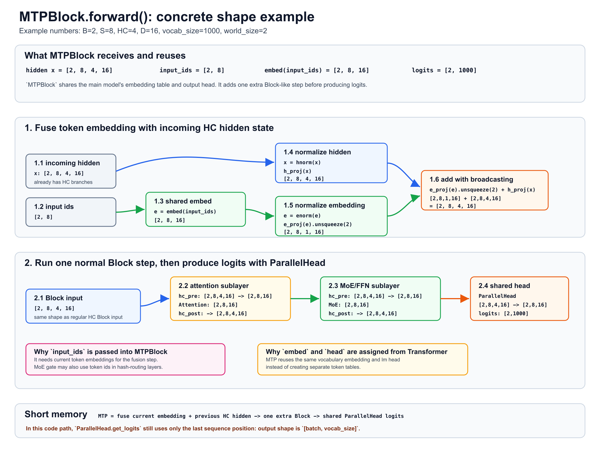

# DeepSeek-V4 Notes

这个 README 用来放学习 DeepSeek-V4 代码时整理的图和简短笔记。

## Tensor Parallel Linear



关键记忆：

- `ColumnParallelLinear`: 切 `out_features`，每个 rank 得到一段输出，不需要 `all_reduce`。
- `RowParallelLinear`: 切 `in_features`，每个 rank 算 partial output，最后用 `all_reduce` 求和。
- PyTorch `Linear` 的权重形状是 `[out_features, in_features]`，计算时等价于 `x @ weight.T`。
- 图里用 `seq_len=4, in_features=8, out_features=12, world_size=2` 做例子。

常见顺序：

```text
x -> ColumnParallelLinear -> activation -> RowParallelLinear -> y
```

## Compressor



关键记忆：

- `Compressor` 用 learned gated pooling 把连续 `compress_ratio` 个 token 压成一个 KV 向量。
- `wkv(x)` 生成候选 KV，`wgate(x)` 生成 gate score。
- `score + ape` 后做 `softmax`，再对同一组 token 的 KV 加权求和。
- 图里用 `B=2, S=10, D=16, compress_ratio=4, head_dim=8` 做例子。
- prefill 时批量压缩，decode 时先存到 `kv_state/score_state`，凑满 `compress_ratio` 才写入 `kv_cache`。
- `compress_ratio == 4` 时会启用 overlap 模式，`coff = 2`。

## ParallelHead



关键记忆：

- `hc_head` 先把 `[B, S, HC, D]` 的多路 hidden choice 合成 `[B, S, D]`。
- `hc_fn` 生成每个 HC 分支的 gate score，`sigmoid` 后作为加权求和的权重。
- 图里用 `B=2, S=8, HC=4, D=16, vocab_size=1000, world_size=2` 做例子。
- `get_logits` 只取 `x[:, -1]`，所以这里只预测下一个 token。
- vocab 在 TP rank 间切分，每个 rank 得到 `[B, vocab_size / world_size]`，最后 `all_gather` 拼成 `[B, vocab_size]`。

## Indexer



关键记忆：

- `Indexer` 给 compressed KV cache 打分，选出每个 token 最应该看的 compressed block。
- 它先从 `qr` 生成 index query，再用自己的 `Compressor` 生成用于打分的 compressed KV。
- `einsum(q, kv_cache)` 得到每个 query token 对每个 compressed block 的分数。
- `weights_proj(x)` 给不同 index head 加权，最后对 head 维度求和。
- prefill 时会 mask 掉包含未来 token 的 compressed block，避免信息泄漏。

## MoE



关键记忆：

- `Gate` 先给每个 token 的所有 routed experts 打分，再选 top-k。
- 图里用 `B=2, S=3, D=16, n_routed_experts=8, topk=2, world_size=2` 做例子。
- routed experts 会按 TP rank 分片，每个 rank 只算自己负责的 expert。
- 每个 expert 输出会乘对应 route weight，再累加回 token 的位置。
- 跨 rank 的 routed 输出用 `all_reduce` 合并，最后再加一个 shared expert。

## MTPBlock



关键记忆：

- `MTPBlock` 接收主模型传来的 HC hidden：`[B, S, HC, D]`。
- 它复用主模型的 `embed`，把 `input_ids` 转成 embedding 后和 hidden 融合。
- 图里用 `B=2, S=8, HC=4, D=16, vocab_size=1000, world_size=2` 做例子。
- 融合后跑一次普通 `Block` 流程：attention 子层 + MoE/FFN 子层。
- 最后复用主模型的 `ParallelHead` 输出 logits。
